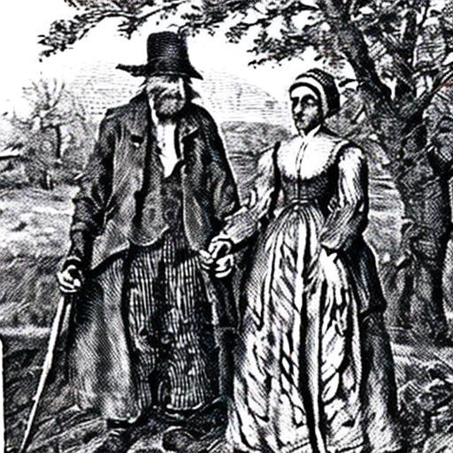
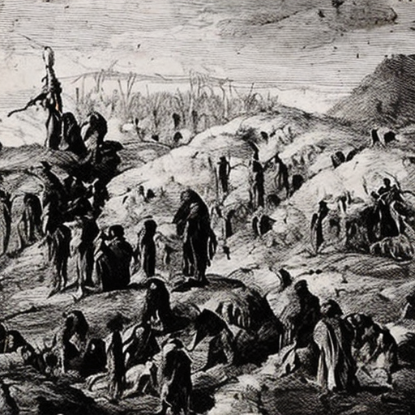

Long ago, in the early pioneer days of New World Quakerism, there dwelt
midst the spacious heart of rural Pennsylvania, a wise old backwoods
carpenter, by name of Joseph McCoffin.

More commonly known as Joseph the Plank.

Gaunt, tall and hard in the face, he had married late in his life to a
young, vibrant Irish girl, by the name of Mary O'Shroud.

✞

Indeed it had been the talk of Squirrel Glade Meeting that year. How
she, a stranger to the House, had tearfully broken in Worship, pouring
forth in anguish her desperate situation. Abandoned, penniless, full
with child. Inflarned in her anger, humiliation and dispair.

'It\'s for tha wee bairn I\'m pleadin\'! Ma wee Jaysus!'

✞

Meticulously the Elders had questioned her. Considering what on Earth
could be done. Her story was far from convincing. Indeed some of the
details of it were unbelievably obscene. Meek souls had wisely counciled
caution against the gypsy magic in her eyes.

Perhaps she could be given some menial work as a kitchen maid?

✞

Now, Joseph the Plank had a habit of going apart after Worship to dwell
some time further within his own personal silence. Mary\'s drama had not
detained him. His hatchet face was hard. There in the lazy afternoon
fields beyond the Meeting House he could be seen performing a strange
choreography of slow graceful movements, his thoughts embedded in the
glorious majesty of the sky. From horizon to horizon, one enormous
flower thus unfolding.

'Mister McCoffin, sir!'

Its one of the young Nayler boys swinging on the creaky gate in the
graveyard wall.

'They wants ya in tha Meetin.'

✞

The old carpenter\'s eccentric ways had long been a rich fund of stories
in his neighbourhood. Indeed no one, not even himself, quite knew what
to expect of him. His workshop was renowned as a legendary and infinite
maze of magic lanterns, glass harmonicas, Leyden jars, huge astrolabes
and delicate hybrid plants. His conversation, what there was of it, was
known to be peculiarly elipical and erratic, often launching out into
the most bizarre and quixotic of speculations. Still, he was respected
as a man of deep feelings and a sympathetic heart. What was needed, it
was generally agreed, was someone to organise his domestic affairs.

✞

The summer sun poured radiant beams of light into the quaint,
whitewashed, oak timbered Meeting House. Joseph enters slowly, his eyes
half closed, breathing in short delicate whispers, tasting the air. His
eyes focus in the depth of her light, and Mary\'s heart leaps within her
breast. She knew it! She just knew it! Her saviour is at hand!

'Believe thee in destiny, lass?'

'Aye sir. I do.'

That was it. They soon were married.

✞

Nine months now passed and the child was born, An exquisite little Red
Indian boy.

✞

From the beginning the stricter folk had thought ill of the union.
Saying that it was undoubtedly Devil[']{dir="rtl"}s work, that she had
bewitched him with those eyes. Indeed her stubborn insistence that the
child should be named Jesus had at first greatly fueled the accusations.
But Joseph had stood by her, and in time it became generally agreed that
she was a good natured and hard working girl, who endeavoured to make of
her volatile temperament an excellent friend, wife and mother.

✞

And so it was, as ever, that the world turned. Years slipped past and
little Jesus McCoffin grew to be as lithe and as animated as the slender
lark[']{dir="rtl"}s tongue willows that skipped endlessly in the April
breeze along the banks of the Glossolalia River.

Before such boundless energy could rankle at the restricted confines of
the settlement, his mother Mary stitched for him a tasseled buckskin
jacket and his father Joseph cut from out the fairy tree a stout and
sturdy hawthorn staff. Into the dark velveteen of the surrounding woods
they would go in search of special timber.

The old carpenter, known far and wide for his fine craftsmanship and the
quality of his materials, now saw that time had come for him to try and
pass his knowledge on.

✞

Mary meanwhile worked the farm with all the radiant devotion of a saint.
Days long the lilt of her Gaelic hymns would drift across the meadows or
linger midst the darkened corners of her kitchen walls. Towards the late
afternoon she would fill for herself a small clay pipe with light
tobacco and climb slowly the rise at the back of the barn to the bench
her husband had built in answer to her wish that she might better view
the sunset. She liked nothing more than a good sigh upon the fading,
lingering beauty of it, and often if "the boys" were late out with their
excursions she would await from there their twilight return.

It was in sweet anticipation of this moment that she busied herself with
the preparation of the evening meal. She would just make this last load
of potato bread and that would be it for the day.

Suddenly, scattering chickens, a shadow appears at the half open kitchen
door. Her little Jesus, wide eyed, breathless. neither able to contain
himself nor find the words to speak.

'Mummy We! am\... It! am\... ah\...'

'Sufferin' Saviours! Ye nearly had me outa me
skin! Will yuh just take a deep breath of yerself now an'
tell us what in tha name a mercy yer blethetin' about. Come
let me wipe that snot of yer nose.'

'Oh Mummy! Oh Mummy? We saw tha footprint. We saw tha
footprint of Big Foot! The Abominable Big Big Hairy Man! It was this\...
BIG\!'

With that he flings his arms open wide, straight out, to demonstrate its
miraculous extent.

Too late\...

Aye, in a God Almighty crash, there[']{dir="rtl"}s the jug of precious
milk spilt across the cold stone floor.

✞

Joseph arrives to find Mary muttering irate imprecations, fit to
explode, while little Jesus drowns before her in a sea of tears.
Gathering them both about him he bids them stop.

With caresses, an impromptu jig, blessed merriment returns.

✞

Indeed they had seen an enormous footprint. A old depression in a moss
strewn slab of stone. A fearsome fossil relic. Tyranasarus Rex perhaps.
A long vanquished, violent and clumsy beast.

Floor cleaned, they set off in search of sunset.

✞

The following Sunday, midway through a placid Meeting, Joseph The Plank
overflows.

'Fellow creatures\...'

In vivid, terse progression the story is told. The spilt milk sending a
half delighted ripple among the curious grey hats of the congregation.

But Friends beware, for the clear hard conclusions that followed did
leave the Squirrel Glade Meeting that day broken in the true nakedness
of their souls.

✞

'Here was our poor wee Jesus, the very picture of the so
called Lord.'

'Perfection gets all the praise. Perfect love, perfect
silence, perfect peace.'

'Oh, people of my heart. Occupants of vacant seats. Will we
find comfort in our thoughts, in our beliefs, or in our religion, if we
don\'t first insist that that comfort shall be guaranteed. Can we risk
to seek in our approach to God not a perfection, not an ideal, but
simply a human, fallible companion.'

'I believe in an imperfect god, from whom I demand no love.
My love alone for the vibrant, impulsive confusion is grace enough and
must always be enough.'

'I believe in Deus Interruptor, the god of interruptions.'

'The peace we experience in these meetings aspires to be a
divine anomaly. An interruption of the interruptions, as when we
momentarily succeed to engage the wandering attentions of a child. God
can sleep passive as an infant through long centuries of slumber that
are but blinkings in an eye, only to wake from this slumber compelled to
surge in wild disruptive energies going forth as the most terrible
earthquake rumbling across the helpless land. God\'s reasons are our
own. God\'s thoughts are our thoughts. An ideal can never be more than
an impulsiveness, no matter how protracted.'

'Does not God too feel shame in the face of her
impulsiveness, in the face of his impulsiveness.'

'I believe in God simply for the sense of unreality it
gives. A stimulant, like locoweed.'

'I believe in destiny because it feeds my sense of humour.'

'My faith is no more than enthusiastic logic.'

'I believe in this Meeting because for me it is never
silent. I come here in the same manner as I go among the trees.'

'I believe that everything is language, and that all
language is alive. Only thus can one retain in part the vision of one\'s
original innocence. Search equally the character of God through the full
expanse of the Everlasting Gospel. God dwells in our experience, memory
and imagination. The hard path of material life is a jostled, tumbling
restlessness, across all the myriad scales of size and time. Memory
strives as best it can to maintain some semblance of stability. But the
language of God is infinite, at least in my imagination it is so, for
there lie the infinitude of personas. The imaginary Quakers, likewise in
empty seats. The imaginary swallows that flit and sweep among the
rafters of that empty ceiling. \[\...\] One God imagining another, and
so on, ad absurdum. By preference God dwells predominately in the
imagination. For from there it is easier to communicate.'

'Which is not to say that God, like any friend, is not
often inconvenient. Preoccupied with an infinitude of stories.
Requiring, demanding even, often inopportune cooperation. But God\'s my
friend, \[\...\] so I put up with it, and try through my devotion to
find games for us to play together, that we might better get
acquainted.'

'I believe that the imagination is a real place. As real as
the air we breathe. As real as the earth beneath our feet. The
atmosphere and core of the sphere \[\...\] that is our inner being. With
in the heart slow currents push and break, the molten core spews forth.
Without, on the finite, endless surface, whistling winds swirl in cycles
of configurations, now soft and gentle, now raging streaked with
electric fire.'

'Aye! It is pantheism I preach. Religion by analogy.'

✞

At that precise moment, thanks be to God, a fly that all this time had
been buzzing infuriatingly before the downcast eyes of the long
suffering Friends, plunged unexpectedly for all concerned headlong
spluttering into Joseph\'s open mouth.

That shut him up.

The door flies open, little Jesus, bloodied, gasping, horrible anguish
upon his face.

'Mummy! Daddy! Oh Daddy!'

Chaos of Joseph coughing, choking, arms outreached to take his child,
the assembly of Friends anxiously quizzing each other. On his knees
Joseph begs the boy to enlighten them.

'I was in the crapper, I sees through me spy hole Indians
ride up. Twelve of them. Mummy comes running out of the house all happy,
running towards them. The just grabbed her. Oh Daddy they were so cruel.
I wanted to run out. I wanted to, I wanted to. They were shouting,
shaking her. Asking her over and over \[Iroquis for child\]. Mummy
shouting, Bastards! Bastards! Bastards! Pounding at them with her fists.
I wanted to run out oh Daddy I wanted to run out.'

Breaks into uncontrollable sobbing. Suddenly goes silent.

'She started pointing to the hill an'
sayin' Get your father. The Indians didn't
seem to understand anything except the pointing. They dragged her up on
the back of the leaders horse and rode off. I ran quick as I
could.'

Clatter of hoofbeats. Panic stricken faces. Bolt the door. Fierce proud
warriors on restless beasts line up before the Meeting House. A speech
is made in Iroquis. A knife is put to Mary's throat. A
group of Elders, Joseph hurrying ahead, attempts to parley.
'They want Jesus. He says the child is his..'

No one knew what to do, not even the Indians. They had never met before
with such courageous passivity. Eventually the leader descends from his
horse and followed by three others strides into the Meeting. The women
and children are huddled together in the centre of the room. The men
forming a ring about them. Prayers. The leader scans the children, his
eyes settling on Jesus. He reaches in, grabbing him by the hair. Tug of
war. Losing patience the Indians systematically slaughter every man,
woman and child, save Jesus alone. They ride off into the sunset.

